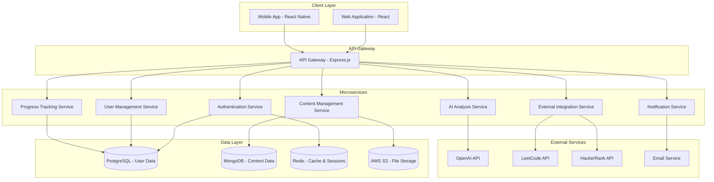

# Design Document: Lab Code Assistant

## Overview

Lab Code Assistant is a modern, AI-powered educational platform built using a microservices architecture with React frontend and Node.js backend services. The platform transforms traditional college programming labs into interactive, career-focused learning experiences through intelligent code analysis, personalized learning paths, and comprehensive progress tracking.

The system employs a scalable, event-driven architecture that can handle growing user bases while maintaining performance. Key design principles include modularity, scalability, security, and user-centric design to ensure the platform can evolve with educational needs and technological advances.

## Architecture

### High-Level Architecture

The platform follows a modern microservices architecture pattern with clear separation of concerns:



### Technology Stack

**Frontend:**
- React 18 with TypeScript for type safety and modern development
- Material-UI (MUI) for consistent, accessible component library
- React Query for efficient data fetching and caching
- React Router for client-side routing
- Chart.js for progress visualization and analytics

**Backend:**
- Node.js with Express.js framework for API services
- TypeScript for type safety across the backend
- JWT for stateless authentication
- Prisma ORM for database interactions
- Bull Queue for background job processing

**Databases:**
- PostgreSQL for relational data (users, progress, relationships)
- MongoDB for document-based content (lab manuals, code snippets)
- Redis for caching, sessions, and real-time features

**Infrastructure:**
- Docker containers for consistent deployment
- AWS/Azure for cloud hosting and scalability
- CDN for static asset delivery
- Load balancers for high availability

## Components and Interfaces

### Authentication Service

**Responsibilities:**
- User registration and login
- JWT token generation and validation
- Password reset and email verification
- Role-based access control (Student, Educator, Admin)

**Key Interfaces:**
```typescript
interface AuthService {
  register(userData: UserRegistration): Promise<AuthResponse>
  login(credentials: LoginCredentials): Promise<AuthResponse>
  validateToken(token: string): Promise<TokenValidation>
  resetPassword(email: string): Promise<void>
  verifyEmail(token: string): Promise<void>
}

interface UserRegistration {
  email: string
  password: string
  firstName: string
  lastName: string
  role: UserRole
  institution?: string
}
```

### Content Management Service

**Responsibilities:**
- Lab manual upload and parsing
- Content digitization and structuring
- Version control for educational content
- Content search and retrieval

**Key Interfaces:**
```typescript
interface ContentService {
  uploadLabManual(file: File, metadata: LabMetadata): Promise<Lab>
  parseLabContent(content: string): Promise<ParsedLab>
  getLabsByCategory(category: string): Promise<Lab[]>
  searchContent(query: SearchQuery): Promise<SearchResults>
}

interface Lab {
  id: string
  title: string
  description: string
  difficulty: DifficultyLevel
  concepts: Concept[]
  exercises: Exercise[]
  createdAt: Date
  updatedAt: Date
}
```

### AI Analysis Service

**Responsibilities:**
- Code analysis and explanation generation
- Concept extraction from code
- Difficulty assessment
- Learning recommendation generation

**Key Interfaces:**
```typescript
interface AIService {
  analyzeCode(code: string, context: AnalysisContext): Promise<CodeAnalysis>
  generateExplanation(code: string, level: ExplanationLevel): Promise<Explanation>
  extractConcepts(code: string): Promise<Concept[]>
  recommendNextSteps(userProgress: UserProgress): Promise<Recommendation[]>
}

interface CodeAnalysis {
  concepts: Concept[]
  complexity: ComplexityMetrics
  suggestions: Improvement[]
  explanation: string
  relatedTopics: Topic[]
}
```

### Progress Tracking Service

**Responsibilities:**
- User learning progress monitoring
- Mastery level calculation
- Performance analytics
- Achievement and milestone tracking

**Key Interfaces:**
```typescript
interface ProgressService {
  trackActivity(userId: string, activity: LearningActivity): Promise<void>
  calculateMastery(userId: string, conceptId: string): Promise<MasteryLevel>
  getProgressDashboard(userId: string): Promise<ProgressDashboard>
  generateAnalytics(userId: string, timeframe: TimeFrame): Promise<Analytics>
}

interface LearningActivity {
  type: ActivityType
  conceptId: string
  timeSpent: number
  accuracy: number
  completed: boolean
  timestamp: Date
}
```

### External Integration Service

**Responsibilities:**
- Integration with coding platforms (LeetCode, HackerRank)
- Problem recommendation based on concepts
- External progress synchronization
- API rate limiting and error handling

**Key Interfaces:**
```typescript
interface IntegrationService {
  getRecommendedProblems(concepts: Concept[]): Promise<Problem[]>
  syncExternalProgress(userId: string, platform: Platform): Promise<void>
  searchProblems(criteria: SearchCriteria): Promise<Problem[]>
  trackExternalCompletion(userId: string, problemId: string): Promise<void>
}
```

## Data Models

### User and Authentication Models

```typescript
interface User {
  id: string
  email: string
  firstName: string
  lastName: string
  role: UserRole
  institution?: string
  careerGoals: CareerRole[]
  preferences: UserPreferences
  createdAt: Date
  lastLoginAt: Date
}

interface UserPreferences {
  explanationLevel: ExplanationLevel
  preferredLanguages: ProgrammingLanguage[]
  learningPace: LearningPace
  notificationSettings: NotificationSettings
}

enum UserRole {
  STUDENT = 'student',
  EDUCATOR = 'educator',
  ADMIN = 'admin'
}

enum CareerRole {
  SOFTWARE_ENGINEER = 'software_engineer',
  DATA_ENGINEER = 'data_engineer',
  ML_ENGINEER = 'ml_engineer',
  FULL_STACK_DEVELOPER = 'full_stack_developer',
  BACKEND_DEVELOPER = 'backend_developer',
  FRONTEND_DEVELOPER = 'frontend_developer'
}
```

### Content and Learning Models

```typescript
interface Lab {
  id: string
  title: string
  description: string
  difficulty: DifficultyLevel
  estimatedTime: number
  prerequisites: Concept[]
  learningObjectives: string[]
  exercises: Exercise[]
  concepts: Concept[]
  careerRelevance: CareerRelevance[]
  createdBy: string
  createdAt: Date
  updatedAt: Date
}

interface Exercise {
  id: string
  title: string
  description: string
  codeTemplate: string
  solution: string
  testCases: TestCase[]
  hints: Hint[]
  concepts: Concept[]
}

interface Concept {
  id: string
  name: string
  description: string
  category: ConceptCategory
  prerequisites: string[]
  difficulty: DifficultyLevel
  futureConnections: FutureConnection[]
}

interface FutureConnection {
  advancedConcept: string
  course: string
  careerRelevance: CareerRole[]
  description: string
}
```

### Progress and Analytics Models

```typescript
interface UserProgress {
  userId: string
  conceptMastery: Map<string, MasteryLevel>
  completedExercises: string[]
  timeSpent: Map<string, number>
  streakDays: number
  achievements: Achievement[]
  currentPath: LearningPath
  lastActivity: Date
}

interface MasteryLevel {
  conceptId: string
  level: number // 0-100
  confidence: number // 0-100
  lastAssessed: Date
  evidencePoints: EvidencePoint[]
}

interface EvidencePoint {
  type: EvidenceType
  value: number
  timestamp: Date
  context: string
}

enum EvidenceType {
  TIME_SPENT = 'time_spent',
  ACCURACY = 'accuracy',
  CONCEPT_CONNECTION = 'concept_connection',
  EXTERNAL_PRACTICE = 'external_practice',
  PEER_COMPARISON = 'peer_comparison'
}

interface LearningPath {
  id: string
  name: string
  careerRole: CareerRole
  concepts: ConceptNode[]
  estimatedDuration: number
  currentPosition: number
}

interface ConceptNode {
  conceptId: string
  order: number
  isCompleted: boolean
  unlockRequirements: string[]
  recommendedResources: Resource[]
}
```

Now I need to use the prework tool to analyze the acceptance criteria before writing the Correctness Properties section.

<function_calls>
<invoke name="prework">
<parameter name="featureName">lab-code-assistant